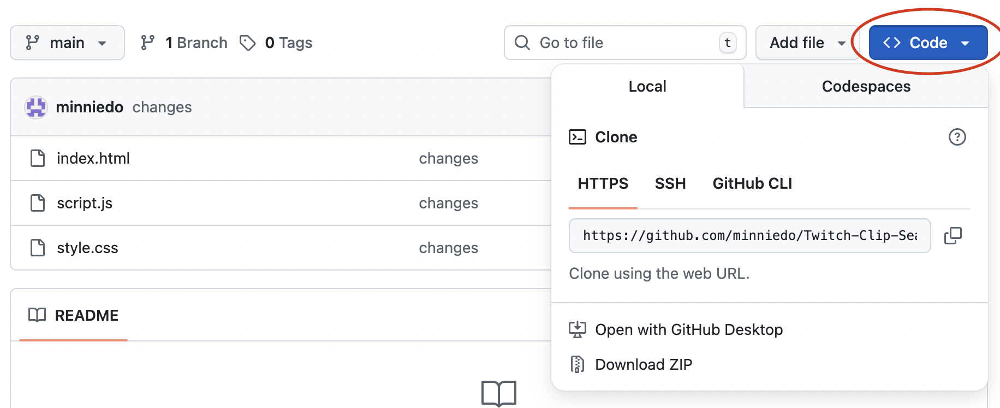

# Github-Version-Control-Guide
---
## How to Setup a New Repository
### 1. Open terminal in IDE (e.g Visual Studio, VSCode, Xcode, etc)

Make sure you are logged into the same GitHub account on your IDE

### 2. Stage and Commit Your Files
Stage the files

```git add . ```

Commit these files

``` git commit -m "<some message" ```

To verify all files are committed

```git status```

If there are untracked files still, add those files individually and commit again

```git add <filename>```

### 3. Create the GitHub Repository
Go to [GitHub](https://github.com) and create a new repository

Follow the instructions on how to push an existing repository from the command line

If you aren't using SSH keys, push via HTTPS instead



```git remote set-url origin <Https url>```


All done. Now you can push changes from your IDE to remote!

---
### Basic Commands

**Stages individual files. Think of it like putting files into a box **to be** saved, but it is not yet saved.  This is usually followed up with a ```git commit```**

 ```git add <filename>```

**Stages all uncommitted files that are within the same directory**

``` git add .``` 

**Saves staged files**

 ```git commit -m "<some commit message>"```

**Check what files are committed/uncommitted**

```git status```

**Push changes from your local branch to the remote branch**

```git push```

**Fetches and merges the latest changes from the remote branch**

```git pull```

**Creates a new local branch based on an existing remote branch**

```git checkout -b my-branch origin/my-branch```

**Creates a remote branch based on an existing local branch**

```git push -u origin my-branch```

**Clone an existing repository onto your local machine**

   Grab the HTTPS url from the repository
   
   ``` git clone <repo-url> ```
  

---
### Miscellaneous 

- **Untracked** files are not yet saved (aka uncommitted)
- A **pull request** is a ticket for any changes you want to make, typically a feature, bugfix, etc
- The **remote** branch is the version that is on GitHub 
- **origin** is the default path prefix to refer to the remote branch (ex: origin/main)
- A **merge conflict** is when there are differences between the same files of your branch and the remote one and Git doesn't know which version of the edits to keep. Some ways this can occur:
  - Another contributor is pushing changes to the same remote branch and you made uncommitted changes
  - You edit the file directly on GitHub and it doesn't match what you have on your local branch
  - The remote branch that the PR is based on is not up to date
- A **README** file gives instructions on setup, notes, etc
- If you have files you want to be secret (e.g subscription keys) add it to **.gitignore** file so anytime you make new branches it is not visible on remote
